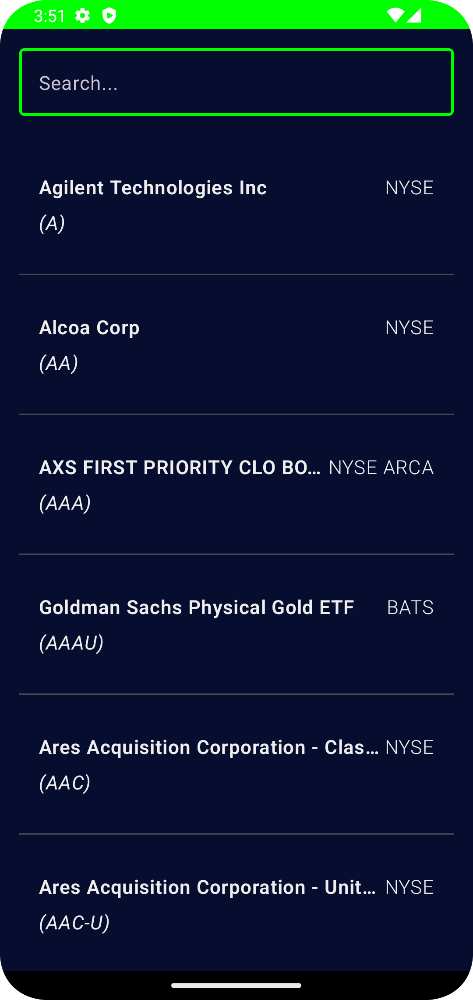
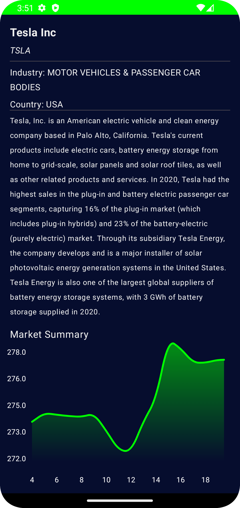

# StockMarketApp

StockMarketApp is an Android application that allows users to explore a list of companies on the American stock market, save them to a local database with a caching mechanism, and visualize the companies' value graphs over time. This project demonstrates the use of modern Android development technologies.

## Technologies Used

- **Architecture**: Clean Architecture
- **UI**: Jetpack Compose
- **Dependency Injection**: Hilt
- **Network Requests**: Retrofit
- **Concurrency**: Kotlin Coroutines and Flow
- **Programming Language**: Kotlin

## Features

- Retrieve a list of companies from the API
- Cache the company list locally with a caching mechanism
- Search for companies in the list
- View detailed information and value graphs of selected companies

## Screenshots

| Company Listings Screen | Company Info Screen |
| ---------------------- | ------------------ |
|  |  |
